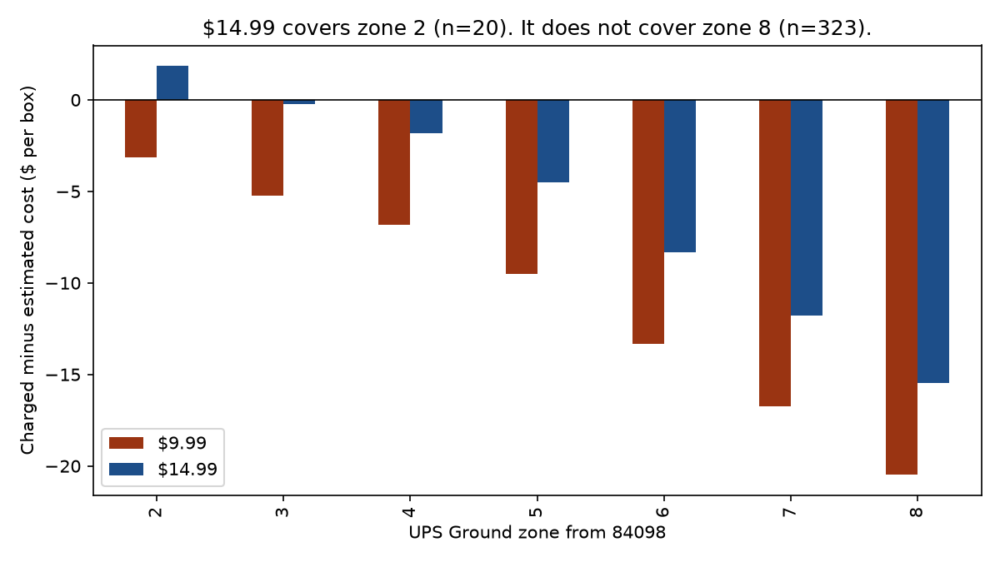

# Consumer Light rate vs a 40 lb UPS Ground parcel

$9.99 Light did not cover this book. The May 2019 move to $14.99 cut the per-box hole by about $5 and did not close zones 6–8, which held the volume.



Zones 5–8 are 1,196 of 1,330 zoned orders. The zone 2 bar is 20 orders.

## What this is / is not

Consumer parcel card only. Paid US orders for the loss-leader bassinet carton, UPS Ground, origin 84098. Sheet-only orders went USPS and are out. Enterprise healthcare shipped freight and is out.

Order-level files are local only and are not in this repo. Shareable outputs are zone aggregates. Cost is published 40 lb Ground daily list times a discount, plus a residential line. Not an invoice. No claim that the subsidy was eliminated.

## 60-second tour

1. `docs/decision.md` — the decision and the discount bounds.
2. `outputs/figures/fig1_subsidy_by_zone.png` — charged minus estimated cost, by zone.
3. `outputs/figures/fig2_volume_by_zone.png` — where the orders sat.
4. `outputs/orders_by_zone_rate.csv` — the counts behind both figures.

## Method

Shipper is 27 x 17 x 12 in, 9 lb actual. UPS daily divisor 139 makes billable weight 40 lb. ZIP3 joined to the origin-84098 Ground zone chart. Paid, not cancelled, US, no HI/AK. 1,548 orders, 1,330 zoned, 218 with no zip excluded.

## Result

488 orders at $9.99, 842 at $14.99. At 50 percent of list plus $3.60 residential, about -$14 a box, then -$9 a box after the rate moved to $14.99.

## Limits

Discount is a scenario, not a billed rate. A recalled deeper account discount is labeled unverified in the memo. Fuel is excluded. The dropped orders are mostly CA, NY, FL, TX, so the zoned hole may be understated.


## How to run

From the project root, with the venv on, this rebuilds the figures from the checked-in aggregates:

```powershell
python src\make_figures.py